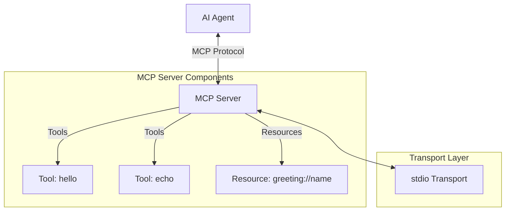

# Model Context Protocol (MCP) Labs

This repository contains a series of labs for learning how to build and use Model Context Protocol (MCP) servers and integrate them with AI Agents. In our labs, we will use Claude Desktop as the AI Agent.

## Lab Structure

- **Lab 01: Hello Claude** - A minimal MCP server with Claude Desktop integration for interactive testing
- *(More labs will be added in the future)*

## What is MCP?

The Model Context Protocol (MCP) is a standardized way for AI models to interact with external tools and data sources. MCP enables AI models like Claude to:

- Access data through resources
- Perform actions through tools
- Get contextual prompts

### MCP Architecture

The diagram below illustrates the basic architecture of an MCP server and how it interacts with AI models:



In this architecture:
- The AI Agent communicates with the MCP server using the standardized protocol
- The server exposes tools that can perform actions
- The server provides resources that can be accessed via URI templates
- Communication happens through a transport layer (e.g., stdio for CLI tools)

## Getting Started

Each lab directory contains its own README with specific instructions. Start with Lab 01 to learn the basics of MCP server implementation and Claude Desktop integration.

```bash
cd lab01-hello-claude
# Be sure to read the README.md in this directory for detailed instructions
cat README.md
```

The lab01 README contains comprehensive instructions for building, running, and testing your MCP server with Claude Desktop, along with explanations of each component.

## Requirements

- Docker (all code runs in containers, no local dependencies needed)
- Claude Desktop (for interactive testing)
- Internet connection (first run downloads MCP Inspector via npx)

## Why Claude Desktop for Testing?

This workshop uses Claude Desktop as the primary testing environment for MCP servers because:

1. **Intuitive User Experience**: AI assistants provide a natural interface for testing tools and resources, eliminating the need for custom UIs or complex CLI commands

2. **Real-world Usage Pattern**: This reflects the emerging trend where users prefer to interact with outside world through the AI assistants they already know and love.

3. **Universal Compatibility**: If your MCP server works with Claude Desktop, it will work with any Agentic AI that implements the MCP standard (Amazon Bedrock, OpenAI, Google Gemini, etc.)

## Resources

- [Model Context Protocol Specification](https://modelcontextprotocol.io)
- [MCP TypeScript SDK](https://github.com/modelcontextprotocol/typescript-sdk)
- [Anthropic Claude Documentation](https://docs.anthropic.com/en/docs/agents-and-tools/mcp)
