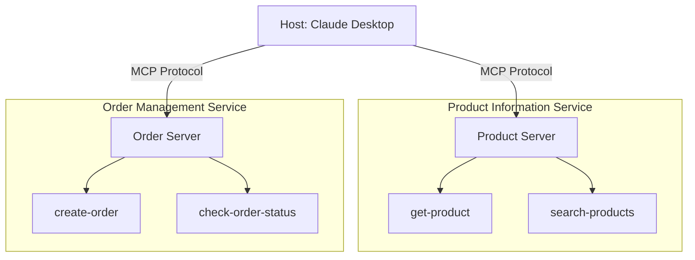

# Lab 02: Retail MCP Servers - Multiple Servers Working Together

This lab demonstrates how multiple MCP servers can work together to create a complete retail system. We'll build two servers: one for product information and another for order management.

## Learning Objectives

By the end of this lab, you will:
- Build multiple MCP servers that work together
- Understand how to structure MCP tools for real-world scenarios
- Use Docker Compose to manage multiple services
- Connect multiple MCP servers to Claude Desktop
- Experience how AI agents orchestrate multiple tools
- Learn patterns for wrapping existing APIs as MCP servers

## Architecture Overview



## Prerequisites

- Completed Lab 01
- Docker and Docker Compose installed
- Claude Desktop installed and configured

## Server Overview

### Product Information Server
- **get-product**: Retrieve detailed information about a specific product
- **search-products**: Search for products by name or category

### Order Management Server
- **create-order**: Create a new order for products
- **check-order-status**: Check the status of an existing order

## Quick Start

1. **Build and start all services**:
```bash
# Build and start both MCP servers
docker-compose up --build
```

2. **Configure Claude Desktop**:
```bash
# Copy the configuration file
cp claude_desktop_config.json "$HOME/Library/Application Support/Claude/"
# For Windows: cp claude_desktop_config.json "$env:APPDATA\Claude\"
```

3. **Restart Claude Desktop** to load the new configuration

## Testing with Claude Desktop

Start a new conversation and try these examples:

### Product Queries
- "What products do you have in the electronics category?"
- "Tell me about product p001"
- "Search for headphones"

### Order Management
- "Create an order for product p001, quantity 2"
- "Check the status of order ord-123"

### Complex Interactions
- "Find all electronics products and create an order for the cheapest one"
- "Check if product p002 is in stock, then create an order for it"

Claude will automatically use the appropriate server and tool for each task, demonstrating how multiple MCP servers work together seamlessly.

## Implementation Details

### Product Server

The product server simulates a product catalog with pre-defined products. In a real-world scenario, this would connect to a database or product management system.

Key patterns demonstrated:
- Parameter validation with Zod schemas
- Optional vs required parameters
- Search functionality with filters
- Structured data responses

### Order Server

The order server simulates order creation and tracking. In production, this would integrate with an order management system.

Key patterns demonstrated:
- Generating unique identifiers
- Status tracking
- Business logic validation
- Cross-server references (product IDs)

### Reality Check

🌍 **Real-World Application**:
- These servers simulate what you'd build to wrap existing REST APIs
- The same pattern works for integrating with databases, microservices, or legacy systems
- Error handling and validation become critical in production
- Authentication and authorization would be added for security

## Project Structure

```
lab02-retail-mcp-servers/
├── README.md
├── docker-compose.yml
├── claude_desktop_config.json
├── product-server/
│   ├── index.js
│   ├── package.json
│   └── Dockerfile
└── order-server/
    ├── index.js
    ├── package.json
    └── Dockerfile
```

## Common Issues

1. **Servers not appearing in Claude Desktop**: Ensure you've restarted Claude after copying the config
2. **Connection errors**: Check that both containers are running with `docker-compose ps`
3. **Tool not found**: Verify the server logs don't show any startup errors

## Cleanup

```bash
# Stop all services
docker-compose down

# Remove all containers and images
docker-compose down --rmi all
```

## What's Next?

This lab demonstrated multiple MCP servers working together locally. Next steps:

- **Lab 3**: Deploy these servers to AWS Lambda
- **Lab 4**: Connect to production AI services like Amazon Bedrock

**Key Insight**: The separation of concerns (product vs order servers) mirrors microservice architecture, making it easy to scale and maintain each service independently.
