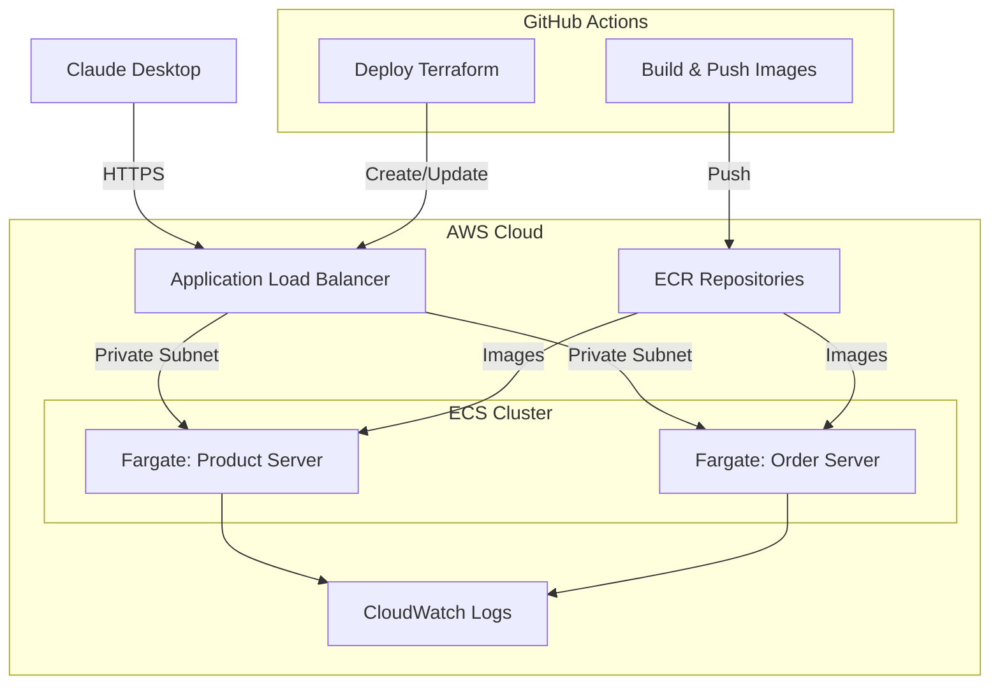

# Lab 03: AWS Cloud Deployment with Fargate

This lab demonstrates how to deploy MCP servers to AWS using Fargate, enabling cloud-based AI tool integration with Claude. We'll take the retail MCP servers from Lab 02 and deploy them to the cloud with proper infrastructure.

## Learning Objectives

By the end of this lab, you will:
- Deploy MCP servers to AWS Fargate for production-ready cloud hosting
- Implement Streamable HTTP transport for MCP (protocol version 2025-03-26)
- Set up Application Load Balancers with HTTPS for secure communication
- Use Terraform for infrastructure as code
- Configure GitHub Actions for automated deployment
- Connect Claude Desktop directly to cloud-hosted MCP servers
- Understand cloud architecture considerations for AI tool integration

## Architecture Overview



## Prerequisites

- Completed Lab 01 and Lab 02
- AWS Account with appropriate permissions
- GitHub account (for GitHub Actions)
- AWS CLI configured locally
- Terraform installed (optional, as GitHub Actions will run it)
- Claude Desktop installed and configured

## Deployment Steps

### 1. Fork and Clone the Repository

If you haven't already, fork the MCP Workshop repository and clone it locally:

```bash
git clone https://github.com/YOUR-USERNAME/mcp-workshop.git
cd mcp-workshop/lab03-aws-cloud-deployment
```

### 2. Set Up GitHub Secrets

You'll need to add AWS credentials to your GitHub repository secrets:

1. Go to your GitHub repository
2. Navigate to Settings > Secrets and variables > Actions
3. Add the following secrets:
   - `AWS_ACCESS_KEY_ID`: Your AWS access key
   - `AWS_SECRET_ACCESS_KEY`: Your AWS secret key
   - `AWS_REGION`: Your preferred AWS region (e.g., us-west-2)

For detailed instructions, see [Setup GitHub Secrets](./docs/setup-github-secrets.md).

### 3. Run the GitHub Actions Workflow

> **Note**: GitHub Actions workflows must be in the root `.github/workflows/` directory to be recognized. The workflow files in this lab's directory are for reference, but copies have been placed in the root directory of the repository.

1. Go to the "Actions" tab in your GitHub repository
2. Select the "Deploy Lab 3 to AWS" workflow
3. Click "Run workflow"
4. Select your AWS region from the dropdown
5. Click "Run workflow" again

The workflow will:
- Build Docker images for both servers
- Push them to Amazon ECR
- Deploy the infrastructure using Terraform
- Output the ALB endpoints for your MCP servers

### 4. Configure Claude Desktop

Once deployment is complete, you'll need to update your Claude Desktop configuration to use the cloud-hosted MCP servers:

1. Open your Claude Desktop configuration file:
   ```bash
   # macOS
   nano ~/Library/Application\ Support/Claude/claude_desktop_config.json
   # Windows
   notepad %APPDATA%\Claude\claude_desktop_config.json
   ```

2. Add the following configuration (replace the URLs with your actual ALB endpoints):
   ```json
   {
     "mcpServers": {
       "aws-product-server": {
         "url": "https://your-product-alb-endpoint.region.elb.amazonaws.com/mcp"
       },
       "aws-order-server": {
         "url": "https://your-order-alb-endpoint.region.elb.amazonaws.com/mcp"
       }
     }
   }
   ```

3. Restart Claude Desktop

## Testing Your Deployment

After adding your servers to Claude Desktop:

1. Open a new chat
2. Enable your tools from the "Search and tools" menu
3. Try these commands:
   - "What products are available in the electronics category?"
   - "Get details for product p001"
   - "Search for all products under $200"
   - "Create an order for 2 units of product p002"
   - "Check the status of my orders"

## Debugging with MCP Inspector

If you encounter issues with your MCP servers, the MCP Inspector tool is invaluable for testing and debugging:

### 1. Install and Run the MCP Inspector

```bash
# Install and run the MCP Inspector
npx @modelcontextprotocol/inspector

# If you're connecting to servers with self-signed certificates, use:
NODE_TLS_REJECT_UNAUTHORIZED=0 npx @modelcontextprotocol/inspector
```

The inspector will be available at http://127.0.0.1:6274 in your browser.

### 2. Connect to Your MCP Servers

1. Enter your MCP server URL (e.g., https://your-product-alb-endpoint.region.elb.amazonaws.com/mcp)
2. Select the appropriate transport type (Streamable HTTP)
3. Click "Connect"

The inspector will discover available tools on your MCP server and allow you to test them directly.

### 3. Test Individual Tool Calls

1. Select a tool from the left sidebar
2. Fill in the required parameters
3. Click "Run Tool"
4. View the response to confirm your server is working correctly

### 4. Troubleshooting Tips

- If you encounter SSL certificate errors, use the `NODE_TLS_REJECT_UNAUTHORIZED=0` flag
- Check CloudWatch logs for detailed request information
- Compare successful requests from the MCP Inspector with requests from Claude or other clients
- Verify network connectivity and security group rules allow traffic to your MCP servers

## Implementation Details

### MCP Servers

The MCP servers in this lab have been adapted from Lab 02 with several key changes:

1. **Streamable HTTP Transport**: Instead of stdio, we're using HTTP with Server-Sent Events (SSE) support
2. **Protocol Version**: Updated to 2025-03-26 which supports streaming responses
3. **Health Check Endpoint**: Required for AWS load balancers
4. **CORS Headers**: Allowing Claude Desktop to connect directly
5. **Persistent Storage**: Using EFS (optional) for order data persistence

### Infrastructure Components

The Terraform configuration creates:

- VPC with public and private subnets
- Application Load Balancers with HTTPS
- ECS Cluster with Fargate services
- ECR repositories for Docker images
- IAM roles and policies
- Security groups
- CloudWatch logs integration

For detailed architecture information, see [Architecture Documentation](./docs/architecture.md).

### Security Note

This lab implements basic security with HTTPS but does not include authentication or authorization. These security aspects will be covered in Lab 05. For production environments, you should implement proper authentication, authorization, and API key management.

## Cleanup

To avoid ongoing AWS charges, clean up your resources when you're done:

```bash
# Option 1: Using the GitHub Actions workflow
1. Go to the "Actions" tab in your GitHub repository
2. Select the "Destroy Lab 3 AWS Resources" workflow
3. Click "Run workflow"

# Option 2: Using Terraform locally
cd terraform
terraform destroy
```

## Real-World Application

🌍 **Cloud Deployment Context**:
- This architecture pattern is used by production AI tool providers
- Fargate provides scalable, managed container hosting without server management
- ALB with HTTPS ensures secure communication between Claude and your tools
- The same pattern works for any AI service that supports the MCP standard
- For production, you would add authentication, monitoring, and alerting

## What's Next?

This lab demonstrated deploying MCP servers to AWS. Next steps:

- **Lab 04**: Connect to production AI services like Amazon Bedrock
- **Lab 05**: Add security with OAuth, API keys, and proper access controls

**Key Insight**: By deploying MCP servers to the cloud, you enable AI assistants to access your organization's tools and data securely from anywhere, without requiring local infrastructure.
