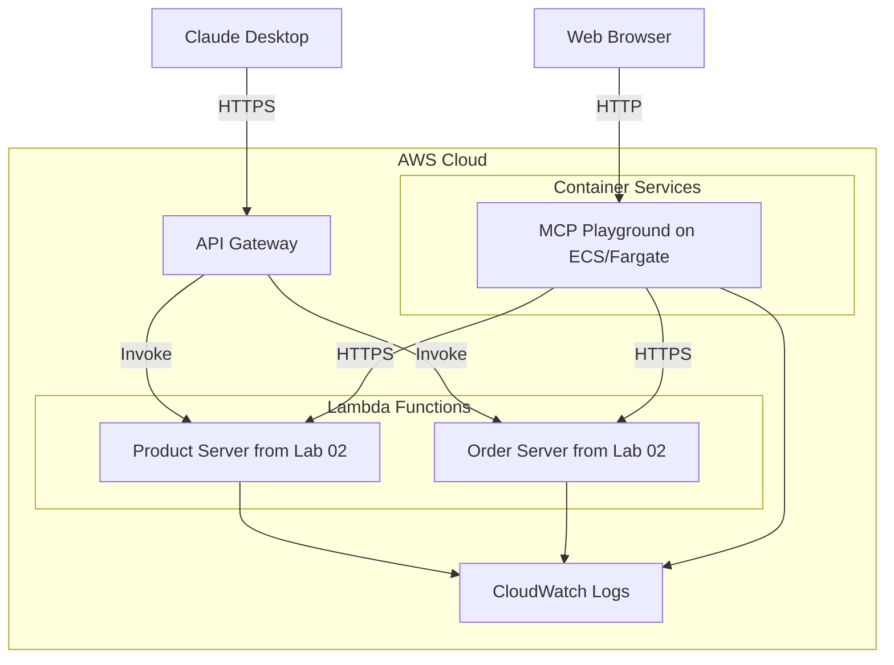
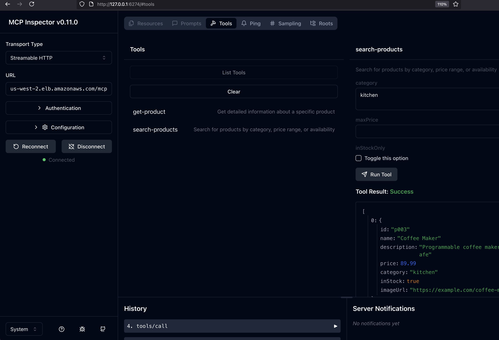

# Lab 03: Cloud Deployment of MCP Servers and Clients

This lab demonstrates how to deploy MCP servers and clients to the AWS Cloud. We'll take the same MCP servers from Lab 02 and deploy them as serverless functions on AWS Lambda, while also providing two different MCP client options: Claude Desktop (running locally) and an Amazon Bedrock-based MCP Playground (running in the cloud).

## Learning Objectives

By the end of this lab, you will:
- Deploy MCP servers from Lab 02 to AWS Lambda for serverless cloud hosting
- Set up API Gateway for secure HTTP endpoints to your MCP servers
- Connect Claude Desktop directly to your cloud-hosted MCP servers
- Deploy a Bedrock-based MCP Playground to ECS/Fargate as an alternative client
- Compare two different MCP client approaches: local (Claude Desktop) vs. cloud (Bedrock)
- Use Terraform for infrastructure as code
- Understand cloud architecture considerations for AI tool integration

## Architecture Overview

This lab implements a dual-client architecture where the same MCP servers can be accessed by both local and cloud-based clients:



### Key Components

1. **MCP Servers (AWS Lambda)**: The same Product and Order servers from Lab 02, now deployed as serverless functions
2. **API Gateway**: Provides secure HTTPS endpoints to access the MCP servers
3. **Two Client Options**:
   - **Claude Desktop** (local): Connect directly to cloud MCP servers from your computer
   - **Bedrock-based MCP Playground** (cloud): An alternative client running on ECS/Fargate

## Prerequisites

- Completed Lab 01 and Lab 02
- AWS Account with appropriate permissions
- GitHub account (for GitHub Actions)
- Claude Desktop installed and configured

## Deployment Steps

### 1. Fork and Clone the Repository

If you haven't already, fork the MCP Workshop repository and clone it locally:

```bash
git clone https://github.com/YOUR-USERNAME/mcp-workshop.git
cd mcp-workshop/lab03-aws-cloud-deployment
```

### 2. Set Up GitHub Secrets

You'll need to add AWS credentials to your GitHub repository secrets:

1. Go to your GitHub repository
2. Navigate to Settings > Secrets and variables > Actions
3. Add the following secrets:
   - `AWS_ACCESS_KEY_ID`: Your AWS access key
   - `AWS_SECRET_ACCESS_KEY`: Your AWS secret key
   - `AWS_REGION`: Your preferred AWS region (e.g., us-west-2)

### 3. Run the GitHub Actions Workflow

1. Go to the "Actions" tab in your GitHub repository
2. Select the "Deploy MCP Workshop Lab to AWS" workflow
3. Click "Run workflow"
4. Select your AWS region from the dropdown
5. Click "Run workflow" again

The workflow will:
- Build and push the MCP Playground Docker image to ECR
- Package the serverless MCP servers for Lambda deployment
- Deploy the infrastructure using Terraform
- Output the endpoints for both the MCP Playground and serverless MCP servers

### 4. Configure Claude Desktop

Once deployment is complete, you'll need to update your Claude Desktop configuration to use the serverless MCP servers:

1. Open your Claude Desktop configuration file:
   ```bash
   # macOS
   nano ~/Library/Application\ Support/Claude/claude_desktop_config.json
   # Windows
   notepad %APPDATA%\Claude\claude_desktop_config.json
   ```

2. Add the following configuration (replace the URLs with your actual API Gateway endpoints from the Terraform output):
   ```json
   {
     "mcpServers": {
       "aws-product-server": {
         "url": "https://your-api-id.execute-api.region.amazonaws.com/dev/product-server/mcp"
       },
       "aws-order-server": {
         "url": "https://your-api-id.execute-api.region.amazonaws.com/dev/order-server/mcp"
       }
     }
   }
   ```

3. Restart Claude Desktop

## Testing Your Deployment

After adding your servers to Claude Desktop:

1. Open a new chat
2. Enable your tools from the "Search and tools" menu
3. Try these commands:
   - "What products are available in the electronics category?"
   - "Get details for product p001"
   - "Search for all products under $200"
   - "Create an order for 2 units of product p002"
   - "Check the status of my orders"

## Debugging with MCP Inspector

If you encounter issues with your MCP servers, the MCP Inspector tool is invaluable for testing and debugging:

### 1. Install and Run the MCP Inspector

```bash
# Install and run the MCP Inspector
npx @modelcontextprotocol/inspector

# If you're connecting to servers with self-signed certificates, use:
NODE_TLS_REJECT_UNAUTHORIZED=0 npx @modelcontextprotocol/inspector
```

The inspector will be available at http://127.0.0.1:6274 in your browser.

### 2. Connect to Your MCP Servers

1. Enter your MCP server URL (e.g., https://your-product-alb-endpoint.region.elb.amazonaws.com/mcp)
2. Select the appropriate transport type (Streamable HTTP)
3. Click "Connect"

The inspector will discover available tools on your MCP server and allow you to test them directly.

### 3. Test Individual Tool Calls

1. Select a tool from the left sidebar
2. Fill in the required parameters
3. Click "Run Tool"
4. View the response to confirm your server is working correctly

### Example of MCP Inspector in Action

Here's what the MCP Inspector looks like when successfully connected to an MCP server and executing a tool call:



*The screenshot shows the MCP Inspector successfully retrieving product information for the Coffee Maker (product ID: p003) from the product server.*

### 4. Troubleshooting Tips

- If you encounter SSL certificate errors, use the `NODE_TLS_REJECT_UNAUTHORIZED=0` flag
- Check CloudWatch logs for detailed request information
- Compare successful requests from the MCP Inspector with requests from Claude or other MCP playgrounds
- Verify network connectivity and security group rules allow traffic to your MCP servers

## Implementation Details

### MCP Servers: From Local to Cloud

In this lab, we take the same Product and Order MCP servers from Lab 02 and deploy them to AWS Lambda with these adaptations:

1. **Same Core Functionality**: The servers provide identical tools and capabilities as in Lab 02
2. **Serverless Architecture**: Deployed as Lambda functions for automatic scaling and pay-per-use pricing
3. **Stateless Design**: Each request creates a new MCP server instance, ideal for serverless environments
4. **API Gateway Integration**: Secure HTTPS endpoints with CORS support

### Dual Client Architecture

This lab demonstrates two different ways to interact with your MCP servers:

#### Option 1: Claude Desktop (Local Client)

- Run Claude Desktop on your local machine
- Configure it to connect directly to your cloud-hosted MCP servers
- Ideal for development and testing with direct control over the client

#### Option 2: Bedrock-based MCP Playground (Cloud Client)

- A containerized web application running on ECS/Fargate
- Connects to Amazon Bedrock (using Claude 3 Haiku model)
- Forwards tool requests to your MCP servers
- Demonstrates a fully cloud-based AI assistant with MCP integration

### Why Two Client Options?

This dual-client approach allows you to:

1. **Compare Implementation Approaches**: Local vs. cloud-based clients
2. **Understand Different Integration Patterns**: Direct connection vs. proxy architecture
3. **Experience Different User Interfaces**: Claude Desktop vs. web-based interface
4. **Explore Cloud Provider Options**: Anthropic Claude Desktop vs. Amazon Bedrock

### Infrastructure Components

The Terraform configuration creates:

- API Gateway HTTP API endpoints for MCP servers
- Lambda functions for the MCP servers
- ECS/Fargate service for the MCP Playground
- VPC networking for secure communication
- IAM roles and policies
- CloudWatch logs integration

### Terraform Organization

The Terraform configuration follows a component-based organization pattern, which is considered a best practice for maintainable infrastructure as code:

- **Component-Based Files**: Each logical component has its own file containing all resources related to that component
  - `product-server.tf`: Lambda function, IAM roles, API Gateway integration, and ALB for the Product Server
  - `order-server.tf`: Lambda function, IAM roles, API Gateway integration, and ALB for the Order Server
  - `mcp-playground.tf`: ECS cluster, task definition, service, ECR repository, IAM roles, and ALB for the MCP Playground

- **Shared Infrastructure Files**:
  - `main.tf`: Provider configuration, random string generation, and API Gateway resources
  - `vpc.tf`: VPC and networking components
  - `variables.tf`: Input variables for the configuration
  - `security-groups.tf`: Shared security groups used by multiple components

This organization makes it easier to understand the relationships between resources within each component and simplifies maintenance as the infrastructure grows.

### Security Note

This lab implements basic security with HTTPS through API Gateway but does not include authentication or authorization. For production environments, you should implement proper authentication, authorization, and API key management.

## Cleanup

To avoid ongoing AWS charges, clean up your resources when you're done:

- Use the "Destroy MCP Workshop Lab on AWS" workflow in GitHub Actions. This will automatically and safely remove all deployed resources.

1. Go to the "Actions" tab in your GitHub repository.
2. Select the "Destroy MCP Workshop Lab on AWS" workflow.
3. Click "Run workflow" and confirm.

> Do **not** run `terraform destroy` locally unless you have a specific reason and understand the implications.

## Real-World Application

🌍 **Cloud Deployment Context**:
- This serverless architecture pattern is used by production AI tool providers
- Lambda provides scalable, cost-effective compute with pay-per-use pricing
- API Gateway ensures secure communication between Claude and your tools
- The same pattern works for any AI service that supports the MCP standard
- For production, you would add authentication, monitoring, and alerting

## Trying Both Client Options

### Using Claude Desktop (Local Client)

After deploying the infrastructure:

1. Configure Claude Desktop to connect to your cloud MCP servers (see instructions in the Deployment Steps section)
2. Open a new chat in Claude Desktop
3. Enable the MCP tools from the "Search and tools" menu
4. Try commands like "Get details for product p003" or "Create an order for 2 units of product p002"

### Using Bedrock-based MCP Playground (Cloud Client)

1. Access the Bedrock client web interface using the URL provided in the deployment output
2. The interface is pre-configured to connect to your MCP servers
3. Try the same commands as above to see how the cloud-based client handles the requests
4. Notice how the Bedrock client acts as a proxy between Amazon Bedrock and your MCP servers

### Comparing the Approaches

As you try both options, consider:
- Which provides a better user experience?
- What are the trade-offs in terms of setup complexity?
- How might each approach fit into different enterprise scenarios?

## What's Next?

- **Lab 04**: Explore more advanced MCP integrations
- **Lab 05**: Add security with OAuth, API keys, and proper access controls

**Key Insight**: This lab demonstrates the flexibility of the MCP standard - the same MCP servers can be accessed by both local and cloud-based clients, giving you multiple options for integrating AI assistants with your organization's tools and data.
