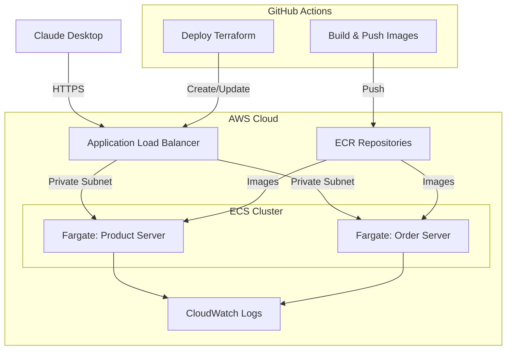

# Lab 03: Architecture Documentation

This document provides detailed information about the architecture used in Lab 03 for deploying MCP servers to AWS using Fargate.

## Architecture Overview

The architecture follows modern cloud-native best practices for deploying containerized applications to AWS:

## Key Components

### 1. Network Infrastructure

- **VPC**: Isolated network environment with public and private subnets
- **Public Subnets**: Host the Application Load Balancers
- **Private Subnets**: Host the Fargate containers for security
- **NAT Gateway**: Allows containers in private subnets to access the internet
- **Security Groups**: Control traffic flow between components

### 2. Container Infrastructure

- **ECR Repositories**: Store Docker images for both MCP servers
- **ECS Cluster**: Logical grouping of Fargate tasks
- **Fargate Tasks**: Serverless container execution environment
- **Task Definitions**: Define container configurations, resources, and networking
- **ECS Services**: Maintain desired number of tasks and handle load balancing

### 3. Load Balancing

- **Application Load Balancers (ALB)**: Route traffic to the appropriate containers
- **Target Groups**: Group containers for load balancing
- **Health Checks**: Monitor container health and replace unhealthy instances
- **HTTPS Support**: Secure communication with SSL/TLS

### 4. Monitoring and Logging

- **CloudWatch Logs**: Centralized logging for containers
- **CloudWatch Metrics**: Monitor resource utilization and performance
- **Auto Scaling**: Adjust capacity based on demand

## Why Fargate?

AWS Fargate was chosen for this lab for several key reasons:

1. **Persistent Connections**: MCP requires persistent connections, especially for streaming responses. Fargate provides long-lived containers, unlike Lambda which has execution time limits.

2. **Simplified Management**: Fargate eliminates the need to manage EC2 instances while still providing container isolation.

3. **Cost Efficiency**: You only pay for the resources your containers use, with no idle capacity.

4. **Scalability**: Fargate can automatically scale based on demand.

## Streamable HTTP Transport

This lab implements the MCP Streamable HTTP transport, which offers several advantages:

1. **Server-Sent Events (SSE)**: Allows streaming responses from the MCP server to the client.

2. **Bidirectional Communication**: Enables real-time updates and streaming content.

3. **Protocol Version 2025-03-26**: Supports the latest MCP features including streaming.

4. **Content Negotiation**: The server can respond with either JSON or SSE based on the client's Accept header.

## Security Considerations

The current implementation includes basic security measures:

1. **HTTPS**: All communication is encrypted using SSL/TLS.

2. **Private Subnets**: MCP servers run in private subnets, not directly accessible from the internet.

3. **Security Groups**: Restrict traffic flow between components.

However, this lab intentionally omits advanced security features that would be covered in Lab 05:

- Authentication and authorization
- API key management
- IP restrictions
- OAuth integration

## Infrastructure as Code

The entire infrastructure is defined using Terraform, providing several benefits:

1. **Reproducibility**: The same infrastructure can be deployed consistently across environments.

2. **Version Control**: Infrastructure changes can be tracked in Git.

3. **Automation**: Deployment can be automated through GitHub Actions.

4. **Documentation**: The Terraform code serves as documentation for the infrastructure.

## CI/CD Pipeline

The GitHub Actions workflow automates the deployment process:

1. **Build Docker Images**: Compile and package the MCP servers.

2. **Push to ECR**: Store the images in Amazon ECR.

3. **Deploy Infrastructure**: Use Terraform to create or update the AWS resources.

4. **Force Deployment**: Update the ECS services to use the new images.

5. **Output Configuration**: Generate Claude Desktop configuration for the deployed servers.

## Scaling Considerations

The architecture supports scaling in several ways:

1. **Horizontal Scaling**: Multiple instances of each MCP server can run concurrently.

2. **Auto Scaling**: ECS services can scale based on CPU utilization.

3. **Load Balancing**: ALBs distribute traffic across multiple containers.

4. **Regional Deployment**: The architecture can be deployed to multiple AWS regions for global availability.

## Future Enhancements

Potential improvements for a production environment:

1. **Persistent Storage**: Add EFS or RDS for durable data storage.

2. **CDN Integration**: Use CloudFront for global content delivery.

3. **Enhanced Monitoring**: Add custom CloudWatch dashboards and alarms.

4. **Multi-Region Deployment**: Deploy to multiple regions for high availability.

5. **Blue/Green Deployments**: Implement zero-downtime deployments.
